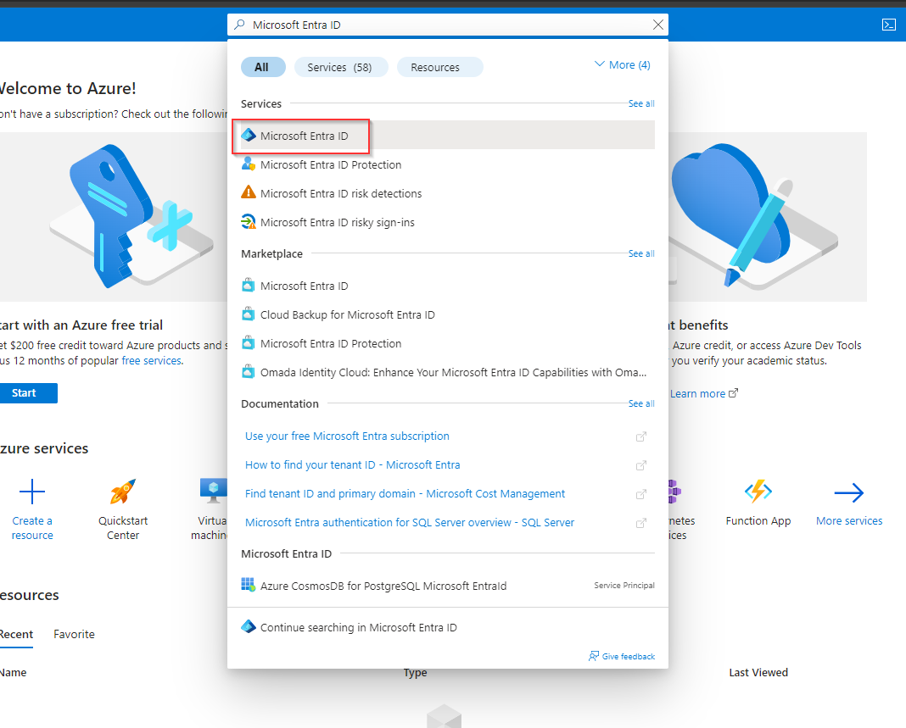
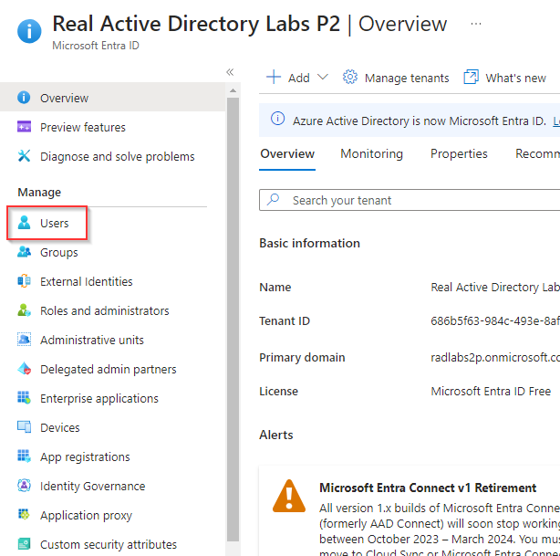

# Create and Manage Microsoft Entra ID Users in the Portal

**There are 4 objectives with this lab:**
* Create Microsoft Entra ID User Accounts
* Modify a Microsoft Entra ID User Account
* Revoke Access to a Microsoft Entra ID User Account
* Delete a Microsoft Entra ID User Account

## Create Microsoft Entra ID User Accounts

Once you're logged into the portal, lets navigate to the Entra ID section of the portal by typing Microsoft Entra ID in the search bar.

Once you're in Entra ID, look for the `Users` blade on the left side. 

Once you've create a sotrage account and a file share, click the Azure Shell icon. Choose Powershell and then click Advanced Settings. Here, input your storage account and File Share information. PowerShell should start to initialize now.

## Modify a Microsoft Entra ID User Account

In PowerShell, we can use simple commands such as `AzResourceGroup`, `AzStorageAccount`, and `AzVM` to see the resources that we've created. Our RG was listed and so was the Storage Account that I created for this lab. The AzVM command had no output because we haven't created a VM yet. 

## Revoke Access to a Microsoft Entra ID User Account

Now, I googled how to create a VM using PowerShell in the Azure Cloud Shell ([link here](https://learn.microsoft.com/en-us/azure/virtual-machines/windows/quick-create-powershell)). The webpage had the following output:

I only chose a few aspects from these parameters since i didn't create a Vnet. I had to create a username and a password. Once that was finished, Azure created the VM. 

## Delete a Microsoft Entra ID User Account

We can use the PowerShell cmdlet `AzVM` to list the newly created VM. We can also go to the portal and check it there.

## Personal Notes

The " ` " character helps make the input more visible. I will definitely be using that. 

Also, I see why people use variables for different parameters such as the subscription and RG. Copy and pasting wasn't working for me (I was probably just doing it wrong) but it would be nice to assign a variable to each of these values and then put the commands in. It's easier to manage. 
