# Create and Manage Microsoft Entra ID Users in the Portal

**There are 4 objectives with this lab:**
* Create Microsoft Entra ID User Accounts
* Modify a Microsoft Entra ID User Account
* Revoke Access to a Microsoft Entra ID User Account
* Delete a Microsoft Entra ID User Account

## Create Microsoft Entra ID User Accounts

Once I was logged into the portal, I navigated to the Entra ID section of the portal by typing Microsoft Entra ID in the search bar.

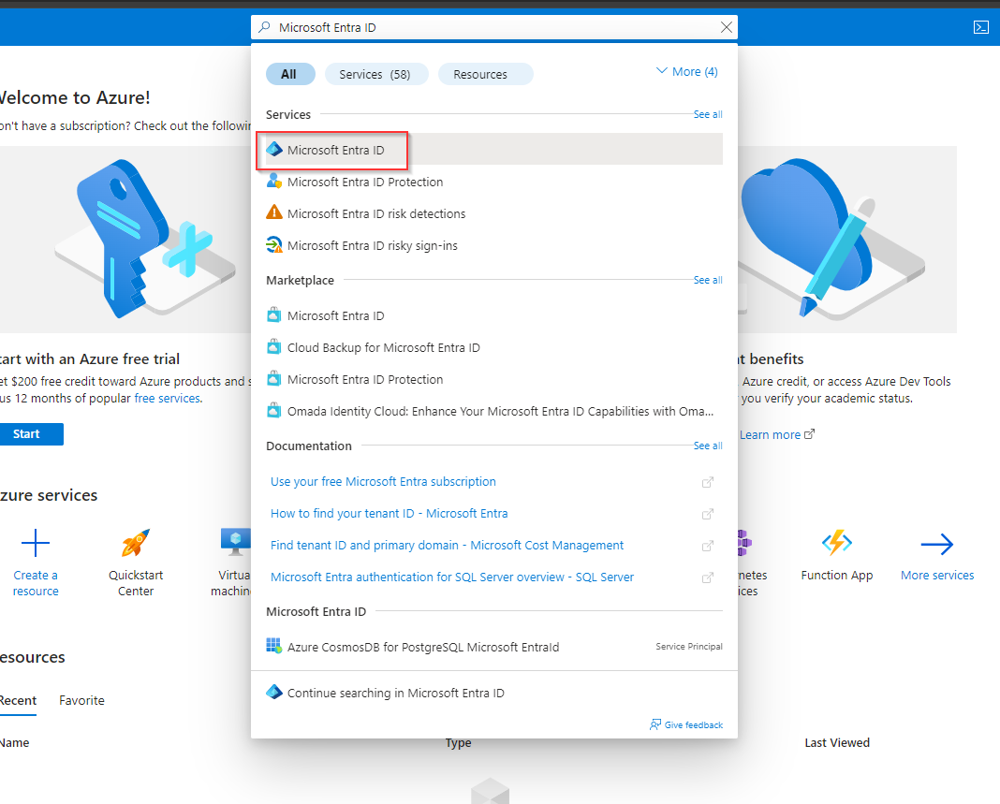

Once I was in Entra ID, I found the `Users` blade on the left side. 

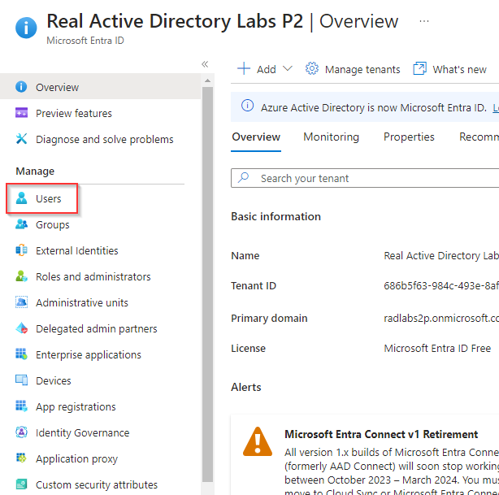

Creating a user is pretty straightforward. I clicked on `New User` at the top of the page and put in the name for my users. We also have to give them a password and Azure conveniently will generate a password for you. 

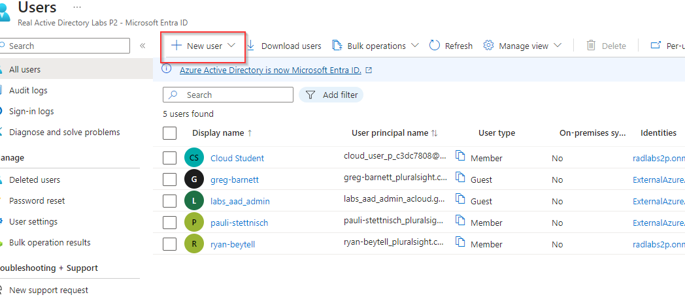

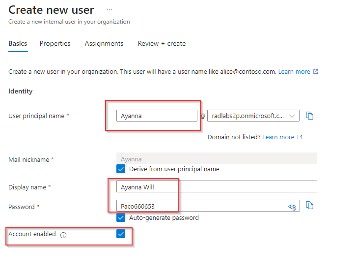

We had to create two users so I created Ayanna Will and Edward Von <3. That completes the first objective.

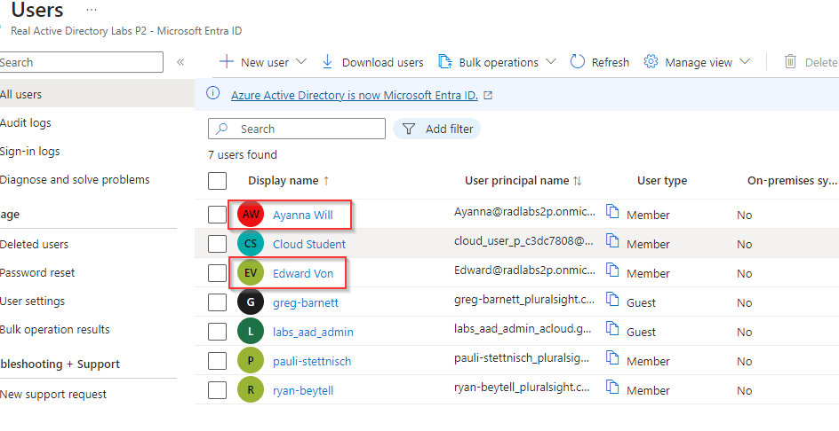

## Modify a Microsoft Entra ID User Account

For the next objective, we were tasked with modifying a user's properties and resetting their password. So I clicked on Ayanna Will's profile, clicked `Edit Properties` and changed her job description. 

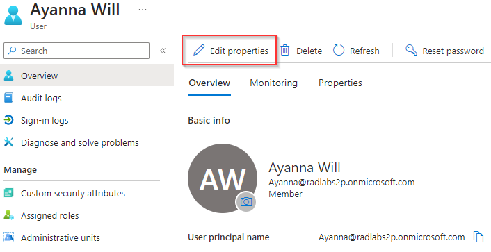

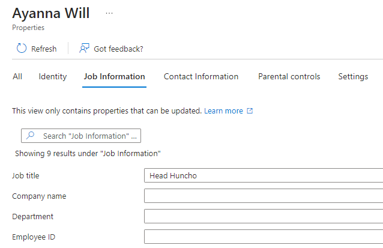

After I saved the changes, I clicked on `Reset Password` at the top of page in order to reset her password. A pop up on the right side of the page will appear displaying the new temporary password.

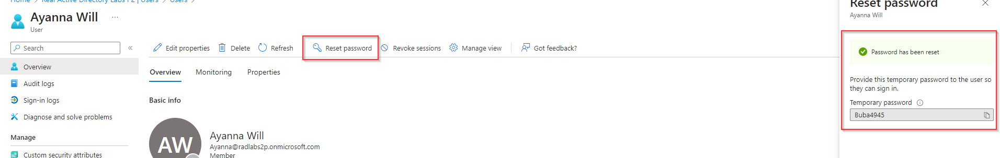

Objective completed!

## Revoke Access to a Microsoft Entra ID User Account

The next objective is to revoke access to a user. I went to Edward Von's profile and then at the top of the page, I clicked `Revoke sessions` which will then log them out of their account. 

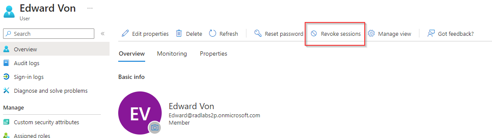

That pretty much completes that revocation process. There's another step when you can disable the account I believe but not delete it. For now, the revoke sessions is enough. 

On to the last objective.

## Delete a Microsoft Entra ID User Account

The final objective is to delete a user. I chose Edward Von again and clicked `Delete` at the top of his profile. 

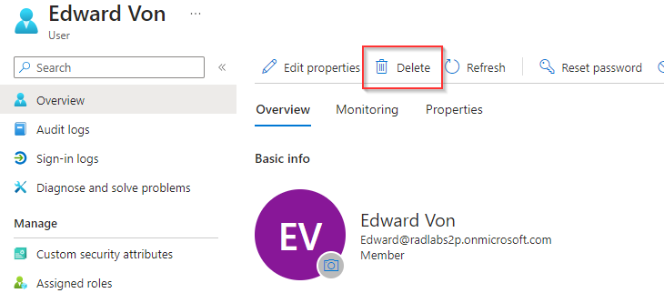

After answering any prompts Azure asked, your profile will be delete which is shown in the current list of users. 

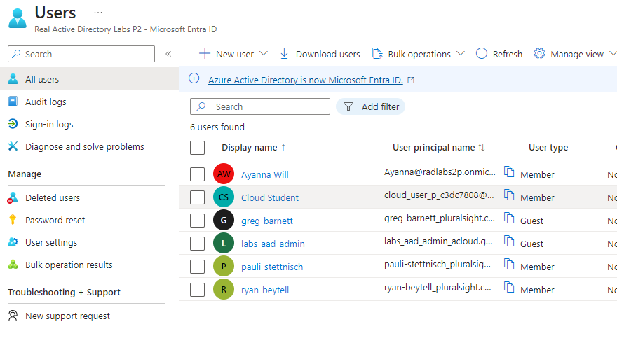

Lab completed!

## Personal Notes

This was an easy lab and it only took 10 minutes. This is one of those things that may just be easier to finish in the Portal instead of automating it. 
